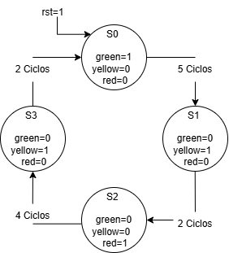
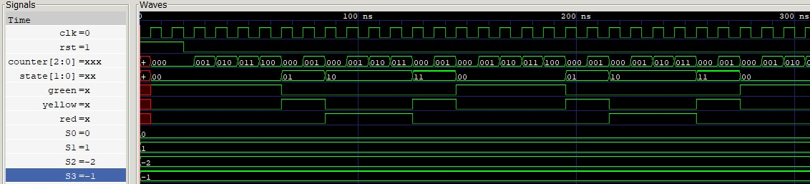
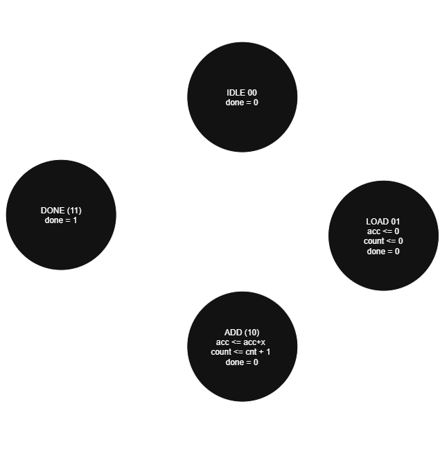
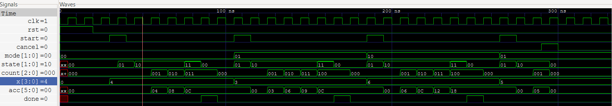
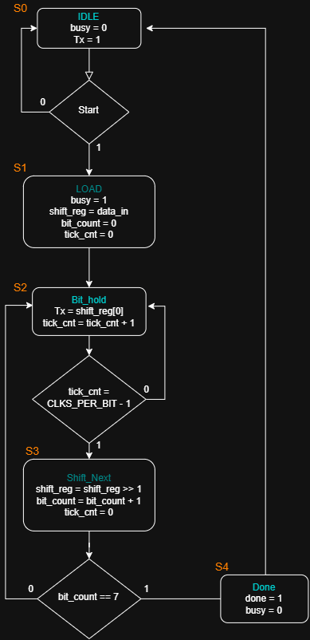
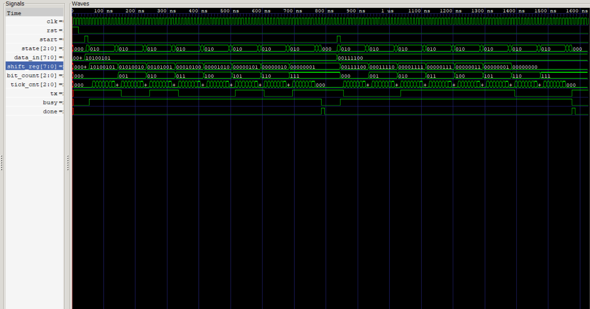

# Lab 00: Introducción a Verilog, Simulación y Máquinas de Estados Finitos (FSM)

**Curso:** Electrónica Digital II  
**Integrantes:**  
* Julian David Gomez Gonzalez
* Cristian Norbey Hernández Gualteros
* Milton Nicolas Rincón Caicedo

---

## 1. Objetivos del Laboratorio
* Instalar y verificar el correcto funcionamiento de Icarus Verilog y GTKWave.
* Comprender la diferencia entre lógica combinacional y lógica secuencial.
* Diseñar e implementar Máquinas de Estados Finitos (FSM) sencillas en Verilog.
* Implementar sistemas que operan a lo largo de varios ciclos de reloj.
* Validar el comportamiento de los diseños mediante testbench y visualización de señales en GTKWave.
---

## 2. Ejercicio 1: FSM de Control – Semáforo Simple

### 2.1 Descripción del Sistema

El sistema implementa un semáforo simple mediante una **Máquina de Estados Finitos (FSM)** desarrollada en Verilog HDL.

El semáforo utiliza cuatro estados para controlar la secuencia de encendido de las luces:

* **S0 – GREEN:** luz verde encendida durante 5 ciclos de reloj.
* **S1 – YELLOW:** luz amarilla encendida durante 2 ciclos de reloj.
* **S2 – RED:** luz roja encendida durante 4 ciclos de reloj.
* **S3 – YELLOW:** luz amarilla encendida durante 2 ciclos de reloj antes de regresar al estado verde.

La secuencia de funcionamiento es:

**GREEN → YELLOW → RED → YELLOW → GREEN → ...**

El uso de dos estados diferentes para la luz amarilla permite representar correctamente las dos transiciones del semáforo: una después del estado verde y otra después del estado rojo.

El sistema recibe dos entradas:

* `clk`: señal de reloj utilizada para sincronizar el funcionamiento de la FSM.
* `rst`: señal de reset que inicializa el sistema en el estado **GREEN (S0)**.

Las salidas son:

* `green`: controla la luz verde.
* `yellow`: controla la luz amarilla.
* `red`: controla la luz roja.

Para controlar la duración de cada estado se utiliza un contador interno que cuenta los ciclos de reloj. Cuando se alcanza el número de ciclos correspondiente al estado actual, la FSM realiza la transición al siguiente estado y el contador vuelve a cero.

### 2.2 Diagrama de Estados (FSM)

  


El diagrama representa los cuatro estados de la FSM y las transiciones entre ellos.

La duración de cada estado se indica en las transiciones:

* **S0 → S1:** después de 5 ciclos.
* **S1 → S2:** después de 2 ciclos.
* **S2 → S3:** después de 4 ciclos.
* **S3 → S0:** después de 2 ciclos.

El estado inicial después de activar el reset es **S0 (GREEN)**.

### 2.3 Simulación y Análisis de Resultados



La simulación se realizó utilizando **Icarus Verilog** como simulador y **GTKWave** para visualizar las formas de onda. Durante la prueba se generó el archivo `semaforo.vcd`.

La señal `clk` presenta un período de **10 ns**, generado mediante:

```verilog
always #5 clk = ~clk;
```

Por lo tanto, la FSM actualiza su estado en cada flanco ascendente del reloj.

Al inicio de la simulación, la señal `rst` se encuentra activa y la FSM se mantiene en el estado **S0**, correspondiente a la luz verde. Al liberar el reset, comienza el conteo de ciclos.

El comportamiento observado en la simulación es:

| Estado | Salida activa | Duración |
| ------ | ------------- | -------: |
| S0     | GREEN         | 5 ciclos |
| S1     | YELLOW        | 2 ciclos |
| S2     | RED           | 4 ciclos |
| S3     | YELLOW        | 2 ciclos |

La secuencia observada en GTKWave es:

**GREEN → YELLOW → RED → YELLOW → GREEN**

y posteriormente vuelve a repetirse.

El contador interno permite verificar la duración de cada estado. Por ejemplo, mientras la FSM se encuentra en **S2**, la señal `red` permanece en `1` mientras el contador avanza hasta completar los 4 ciclos correspondientes. Al alcanzar el límite de 4 ciclos, la FSM cambia al estado **S3**, `red` pasa a `0` y `yellow` pasa a `1`.

De esta manera, la simulación confirma que la FSM realiza correctamente las transiciones programadas y que solamente una de las tres luces permanece activa en cada estado.

---

## 3. Ejercicio 2: FSM con Datapath – Acumulador Secuencial

### 3.1 Arquitectura (Control y Datapath)

El sistema diseñado desacopla la lógica en dos bloques fundamentales: la **Unidad de Control (FSM)** y la **Ruta de Datos (Datapath)**. Esta separación permite procesar la acumulación de datos de entrada mediante operaciones aritméticas iterativas a lo largo de varios ciclos de reloj.

#### A. Entradas y Salidas del Sistema
* **Entradas:**
  * `clk`: Señal de reloj global del sistema (sincroniza las transiciones y registros).
  * `rst`: Reset síncrono general (reinicia el sistema al estado inicial).
  * `start`: Pulso de inicio de 1 ciclo de reloj para comenzar una operación.
  * `cancel`: Señal de interrupción inmediata en cualquier momento del cómputo.
  * `mode[1:0]`: Selector de 2 bits para definir la variante o criterio de acumulación.
  * `x[3:0]`: Dato de entrada de 4 bits (valores entre 0 y 15).
* **Salidas:**
  * `acc[5:0]`: Acumulador de 6 bits que almacena la suma total (soporta hasta 63 sin desbordamiento).
  * `done`: Señal que indica la finalización exitosa del cálculo, manteniéndose en alto durante exactamente un ciclo de reloj.

---

#### B. Unidad de Control (FSM)
La máquina de estados gestiona el flujo de operación mediante 4 estados codificados en 2 bits:

1. **`IDLE` (`2'b00`):** Estado de reposo. Mantiene `done = 0` y permanece a la espera de un pulso en `start`.
2. **`LOAD` (`2'b01`):** Estado de inicialización. Prepara los registros del datapath para un nuevo ciclo de cálculo.
3. **`ADD` (`2'b10`):** Estado de cómputo. En cada flanco de subida del reloj, ordena sumar la entrada `x` al acumulador e incrementa el contador de iteraciones, evaluando la condición de parada según el modo seleccionado.
4. **`DONE` (`2'b11`):** Estado de terminación. Aserta `done = 1` durante un único ciclo y regresa automáticamente a `IDLE`.

---

#### C. Ruta de Datos (Datapath)
El datapath contiene los elementos de memoria y componentes aritméticos:
* **Registro Acumulador (`acc[5:0]`):** Registro que se inicializa en `0` en el estado `LOAD` y acumula la suma síncrona `acc <= acc + x` durante el estado `ADD`.
* **Contador de iteraciones (`count[2:0]`):** Registro interno de 3 bits que contabiliza los ciclos transcurridos en el estado `ADD` para los modos que requieren un número fijo de sumas.
* **Sumador combinacional:** Realiza la adición de `acc + x` y permite evaluar de manera anticipada condiciones de término.

---

#### D. Integración de las 4 Variantes Requeridas
El módulo integra la totalidad de los requerimientos mediante las señales `mode` y `cancel`:
* **Modo `2'b00` (Sumar $x$ 3 veces):** La FSM permanece en `ADD` hasta que el contador alcanza 3 ciclos (`count == 2`), totalizando tres sumas de $x$ antes de pasar a `DONE`.
* **Modo `2'b01` (Sumar $x$ 4 veces):** La FSM permanece en `ADD` hasta completar 4 ciclos (`count == 3`), sumando el valor cuatro veces antes de concluir.
* **Modo `2'b10` (Sumar $x$ hasta que $acc \ge 20$):** El sistema evalúa en cada ciclo la suma resultante. En el ciclo donde la suma alcance o supere 20 ($acc + x \ge 20$), realiza la última acumulación y transiciona inmediatamente a `DONE`.
* **Mecanismo de Cancelación (`cancel`):** Si la entrada `cancel` se activa en alto durante cualquier fase de la operación, la FSM transiciona de forma prioritaria al estado `IDLE`, reinicia `acc` y `count` a cero, y garantiza que la señal `done` nunca se active.


### 3.2 Diagrama de Estados y Transiciones

El control secuencial se modela mediante una FSM tipo Moore con 4 estados definidos.



#### Tabla de Transición y Salidas de la FSM

| Estado Actual | Condición de Entrada / Evaluación | Estado Siguiente | Acciones en Datapath / Salidas |
| :--- | :--- | :--- | :--- |
| **`IDLE`** (`2'b00`) | `start == 0`<br>`start == 1` | `IDLE`<br>`LOAD` | `done = 0`<br>`count <= 0` |
| **`LOAD`** (`2'b01`) | `cancel == 1`<br>`cancel == 0` | `IDLE`<br>`ADD` | `acc <= 0`<br>`count <= 0` |
| **`ADD`** (`2'b10`) | `cancel == 1`<br>Modo 00 y `count < 2`<br>Modo 00 y `count == 2`<br>Modo 01 y `count < 3`<br>Modo 01 y `count == 3`<br>Modo 10 y `(acc + x) < 20`<br>Modo 10 y `(acc + x) >= 20` | `IDLE`<br>`ADD`<br>`DONE`<br>`ADD`<br>`DONE`<br>`ADD`<br>`DONE` | `acc <= acc + x`<br>`count <= count + 1`<br>`done = 0` |
| **`DONE`** (`2'b11`) | Incondicional (1 ciclo) | `IDLE` | `done = 1` |
### 3.3 Simulación y Análisis de Resultados
<!-- Imagen de GTKWave del Ejercicio 2 -->

Síncrono
#### Análisis de las Formas de Onda Obtenidas

1. **Prueba 1: Acumulación de 3 veces (Modo `00`, $x = 4$)**
   * **Comportamiento:** Tras recibir el pulso de inicio `start`, el sistema pasa por `LOAD` (donde limpia `acc` y `count`) y entra al estado `ADD` (`state = 10`).
   * **Evolución del Datapath:** Se observa que en cada flanco positivo de reloj el acumulador incrementa en pasos de 4: $04_{16} \rightarrow 08_{16} \rightarrow 0C_{16}$ ($12_{10}$). Simultáneamente, el contador interno avanza: `001` $\rightarrow$ `010` $\rightarrow$ `011`.
   * **Finalización:** Al completar la tercera iteración, la FSM transiciona a `DONE` (`state = 11`), donde la bandera `done` se mantiene en alto durante exactamente un ciclo de reloj antes de regresar a `IDLE`.

2. **Prueba 2: Acumulación de 4 veces (Modo `01`, $x = 3$)**
   * **Comportamiento:** Se inicia con $x = 3$. El sistema entra a `ADD` y acumula durante 4 ciclos consecutivos.
   * **Evolución del Datapath:** El acumulador evoluciona en secuencia: $03_{16} \rightarrow 06_{16} \rightarrow 09_{16} \rightarrow 0C_{16}$ ($12_{10}$). El contador `count` registra los cuatro flancos activos llegando al valor binario `100` (4).
   * **Finalización:** Se genera correctamente el pulso de fin `done = 1` por un ciclo y el sistema retorna a reposo.

3. **Prueba 3: Acumulación hasta umbral $acc \ge 20$ (Modo `10`, $x = 6$)**
   * **Comportamiento:** Se configura una entrada constante de $x = 6$. El sistema suma iterativamente sin depender de un número fijo de ciclos, evaluando en cada ciclo si la suma alcanza o supera 20.
   * **Evolución del Datapath:** La progresión observada es: $06_{16} \rightarrow 0C_{16} (12_{10}) \rightarrow 12_{16} (18_{10}) \rightarrow 18_{16} (24_{10})$.
   * **Criterio de Parada:** En el cuarto ciclo, al alcanzar $24_{10}$ (valor mayor o igual a 20), la condición se satisface y la FSM avanza a `DONE` en el siguiente flanco, confirmando la correcta evaluación del umbral.

4. **Prueba 4: Mecanismo de Cancelación Inmediata (`cancel`)**
   * **Comportamiento:** Durante una operación en curso (alrededor de los 290 ns, con $x = 5$ y el acumulador en $05_{16}$), se aserta la señal `cancel`.
   * **Respuesta del Sistema:** La FSM aborta inmediatamente el cálculo y retorna al estado `IDLE` (`00`). Los registros `acc` y `count` son forzados a cero.
   * **Validación Crítica:** Se confirma en las señales que la bandera `done` permanece en bajo (`0`) durante todo el evento de cancelación, demostrando que no se emiten falsos pulsos de finalización ante interrupciones.


---
## 4. Ejercicio 3: Máquina ASM – Transmisor Serial Síncrono (Bono)

### 4.1 Descripción de la Arquitectura y Datapath

El diseño consiste en un transmisor serial síncrono de 8 bits implementado mediante una Máquina de Estados Algorítmica (ASM) completa. La arquitectura integra la Unidad de Control (FSM de 5 estados) y el Datapath (registros y contadores) para gestionar la captura de datos en paralelo y su posterior transmisión serial.

#### Componentes Internos (Datapath y Control)
* **Registro de Desplazamiento (`shift_reg` - 8 bits):** Almacena el dato de entrada `data_in` e interactúa desplazando su contenido a la derecha (`shift_reg >> 1`) para entregar el bit menos significativo (LSB) a la salida serial.
* **Contador de Bits (`bit_count` - 3 bits):** Lleva el seguimiento numérico de los bits transmitidos (de 0 a 7).
* **Temporizador de Ancho de Bit (`tick_cnt` - `$clog2(CLKS_PER_BIT)` bits):** Cuenta los ciclos de reloj para mantener la señal `tx` estable durante el tiempo definido por el parámetro `CLKS_PER_BIT`.
* **Registro de Estado (`state` - 3 bits):** Almacena el estado actual de la FSM para coordinar las operaciones del datapath.

#### Entradas del Sistema
* `clk`: Reloj principal del sistema.
* `rst`: Reset síncrono para inicializar el sistema a su estado de reposo.
* `start`: Pulso de inicio de transmisión (1 ciclo de reloj de duración).
* `data_in[7:0]`: Byte de datos recibido en paralelo para ser transmitido.

#### Salidas del Sistema
* `tx`: Línea de salida serial (se mantiene en nivel alto `1` en estado de reposo).
* `busy`: Indicador de estado que permanece activo (`1`) durante todo el proceso de transmisión.
* `done`: Pulso de 1 ciclo de reloj que notifica la finalización exitosa de la transmisión.

---

### 4.2 Diagrama de la ASM

La máquina de estados finitos sigue el flujo algorítmico estructurado en los siguientes 5 estados:

1. **`S0: IDLE`:** La línea `tx` permanece en alto (`1`) y `busy = 0`. Al recibir un pulso en `start = 1`, la FSM transiciona a `LOAD`.
2. **`S1: LOAD`:** Se carga el byte `data_in` en `shift_reg`, se reinician los contadores `bit_count` y `tick_cnt`, y se activa `busy = 1`.
3. **`S2: BIT_HOLD`:** Mantiene el bit actual en la línea `tx` (`shift_reg[0]`) e incrementa `tick_cnt`. Permanece en este estado hasta que `tick_cnt == CLKS_PER_BIT - 1`.
4. **`S3: SHIFT_NEXT`:** Evalúa si se han transmitido los 8 bits (`bit_count == 7`). Si faltan bits, desplaza `shift_reg` a la derecha, incrementa `bit_count`, reinicia `tick_cnt = 0` y retorna a `BIT_HOLD`. Si ya finalizó, pasa a `DONE`.
5. **`S4: DONE`:** Emite el pulso de finalización `done = 1` por 1 ciclo de reloj, desactiva `busy = 0`, restituye `tx = 1` y retorna a `IDLE`.



### 4.3 Simulación y Análisis de Transmisión


Para validar el funcionamiento del transmisor serial síncrono, se ejecutó la simulación en Icarus Verilog y se analizaron las formas de onda resultantes en GTKWave. 

En el testbench se configuró el parámetro CLKS_PER_BIT = 8 (con un periodo de reloj de  $T_{clk} = 10\text{ ns}$) y se evaluó la transmisión secuencial de dos datos de prueba: 8'hA5 y 8'h3C (10100101 y 00111100)




#### Análisis del Comportamiento

1. Inicialización y Reset:
   * En principio, la señal `rst` se activa durante 2 ciclos. La FSM se inicializa en el estado `IDLE` (`state = 0`), manteniendo `busy = 0`, `done = 0` y la línea serial en reposo (`tx = 1`).

2. Transmisión 1 Dato `10100101`:
   * Carga: Al detectarse el pulso de 1 ciclo en `start`, el sistema conmuta a `LOAD` (`state = 1`), cargando `shift_reg = 10100101`, reiniciando los contadores (`bit_count = 0`, `tick_cnt = 0`) y activando `busy = 1`.
     
   * Envío Bit a Bit (LSB Primero):
     * Primer Bit (`1`): La FSM pasa al estado `BIT_HOLD` (`state = 2`). La salida `tx` toma el valor `1` del bit LSB (`shift_reg[0]`) y se mantiene estable durante exactamente 8 ciclos de reloj (80 ns), controlados por `tick_cnt` contando de `0` a `7`.
       
     * Siguiente Bit y Desplazamientos : Al llegar `tick_cnt = 7`, el sistema conmuta a `SHIFT_NEXT` (`state = 3`), donde `shift_reg` se desplaza a la derecha convirtiéndose en `01010010`, `bit_count` se incrementa a `1` y `tick_cnt` se reinicia a `0` para regresar a `BIT_HOLD` (`state = 2`).
       
     * Bits 1 a 7: La secuencia de estados entre `BIT_HOLD` (`state = 2`) y `SHIFT_NEXT` (`state = 3`) se repite iterativamente enviando los bits `0`, `1`, `0`, `0`, `1`, `0` y `1`. Esto se refleja en el desplazamiento progresivo de `shift_reg`: `01010010` → `00101001` → `00010100` → `00001010` → `00000101` → `00000010` → `00000001`, mientras `bit_count` se incrementa en cada paso hasta llegar a `7`.
       
   * Finalización: Tras transmitir el último bit (`bit_count == 7` en `SHIFT_NEXT`), la FSM entra al estado `DONE` (`state = 4`), donde emite un pulso de `done = 1` de exactamente 1 ciclo de reloj, desactiva `busy = 0` y retorna al estado `IDLE` (`state = 0`).

3. Transmisión 2 Dato `00111100`:
   * Tras retornar a `IDLE` (`state = 0`), un nuevo pulso de `start` conmuta a `LOAD` (`state = 1`) para iniciar la transmisión de `00111100`.
     
   * El sistema recorre nuevamente la secuencia de estados `BIT_HOLD` (`state = 2`) y `SHIFT_NEXT` (`state = 3`). El registro se desplaza secuencialmente (`00111100` → `00011110` → `00001111` → `00000111` → `00000011` → `00000001` → `00000000`), enviando los bits desde el LSB (`0`) hasta el MSB (`0`).
     
   * Cada bit mantiene su duración exacta de 8 ciclos de reloj (80 ns) medida por `tick_cnt`.
     
   * La transmisión concluye al pasar por `DONE` (`state = 4`), generando el pulso de `done = 1` por 1 ciclo  y desactivando `busy = 0` para regresar a `IDLE` (`state = 0`).

---


---

## 5. Conclusiones

* **Separación de Control y Ruta de Datos (FSM + Datapath):** Se demostró que separar la máquina de estados finitos de los elementos aritméticos y de almacenamiento simplifica el diseño de sistemas secuenciales complejos. Mientras la FSM se encarga únicamente de dirigir el flujo temporal y de validar condiciones lógicas (`start`, criterios de parada, `cancel`), el datapath realiza las transferencias entre registros (`acc`, contadores) de forma determinista y predecible.

* **Sincronización y Naturaleza de la Lógica Secuencial:** A diferencia de los circuitos puramente combinacionales donde las salidas cambian inmediatamente con las entradas, la sincronización por flancos de subida del reloj (`posedge clk`) permitió coordinar operaciones multi-ciclo. Esto fue esencial para mantener la temporización estricta de cada luz en el semáforo vehicular y para la acumulación paso a paso en el acumulador.

* **Precisión Temporal y Generación de Señales de Control:** A través de las simulaciones se mostró la importancia de diseñar señales de estatus como pulsos de duración exacta. En el acumulador, la señal `done` se activó durante exactamente un ciclo de reloj al terminar el cálculo, garantizando una interfaz de comunicación segura con otros módulos y evitando falsos disparos.

* **Mecanismos de Cancelación e Inicialización Segura:** La inclusión de señales como `rst` y `cancel` demostró ser fundamental para la robustez del hardware. Se validó que una condición de interrupción en pleno cómputo devuelve la FSM al estado `IDLE`, reinicia los acumuladores y suprime la bandera `done`, asegurando que el sistema no propague datos inconsistentes.

* **Importancia de la Verificación con Icarus Verilog y GTKWave:** La simulación temporal mediante bancos de pruebas (*testbenches*) permitió rastrear el comportamiento interno ciclo a ciclo, facilitando la detección de condiciones de carrera, errores de conteo y verificación de estados internos antes de una eventual implementación en hardware físico.
